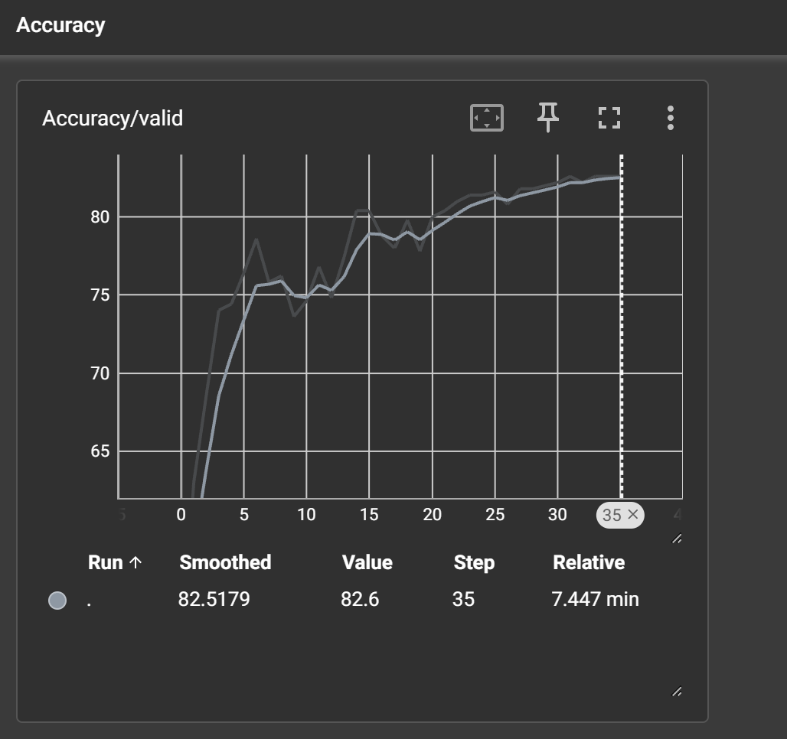

# Butterfly Image Classification

A Computer Vision project developed during an internship to classify butterfly species using a custom Convolutional Neural Network (CNN).

## Features
- Loads and preprocesses butterfly images from the 40-species dataset.
- Implements a custom CNN with three convolutional layers and two fully connected layers.
- Uses data augmentation (e.g., random horizontal flips) for training robustness.
- Trains on 100 classes with TensorBoard logging for performance tracking.
- Achieves approximately 82% test accuracy.

## Prerequisites
- Python 3.10+.
- Required libraries:
  - `torch`
  - `torchvision`
  - `numpy`
  - `pandas`
  - `tensorboard`
- Dataset: Butterfly Images 40 Species (available on Kaggle: [dataset link](https://www.kaggle.com/datasets/gpiosenka/butterfly-images40-species)).

## Installation
1. Clone the repository:
   ```bash
   git clone https://github.com/your-username/Butterfly-Image-Classification.git
   cd Butterfly-Image-Classification
   ```
2. Install dependencies:
   ```bash
   pip install torch torchvision numpy pandas tensorboard
   ```
3. Download the dataset from Kaggle and place it in a `data/` folder (adjust paths in the notebook accordingly).

## Usage
1. Run the notebook:
   ```bash
   jupyter notebook classification-task\ \(2\).ipynb
   ```
2. Execute cells to train the model and view results.
3. For TensorBoard visualization, run locally:
   ```bash
   tensorboard --logdir=logs
   ```
   Then open [http://localhost:6006/](http://localhost:6006/) in your browser.

## Code Overview
- **Data Loading**: Uses `torchvision.datasets.ImageFolder` to load images with transformations.
- **Model**: CustomCNN with `Conv2d` layers, `MaxPool2d`, and `Linear` layers.
- **Training**: Implements early stopping, learning rate scheduling, and validation with `torch.optim.Adam`.

## Testing
- Trained on a Kaggle dataset with 100 butterfly species.
- Achieved 82% accuracy on the test set after early stopping at 37 epochs.
- Validated with TensorBoard logs and the `Accuracy.png` chart.

## Notes
- The model was trained on Kaggle’s environment; adjust file paths for local use.
-  visualizes the model’s performance over time.
-  shows training and validation curves.

## Dependencies
- Python libraries: `torch`, `torchvision`, `numpy`, `pandas`, `tensorboard`.

## Conclusion
This project demonstrates Computer Vision skills using PyTorch for multi-class image classification. It’s extensible for other image datasets or deeper architectures.
